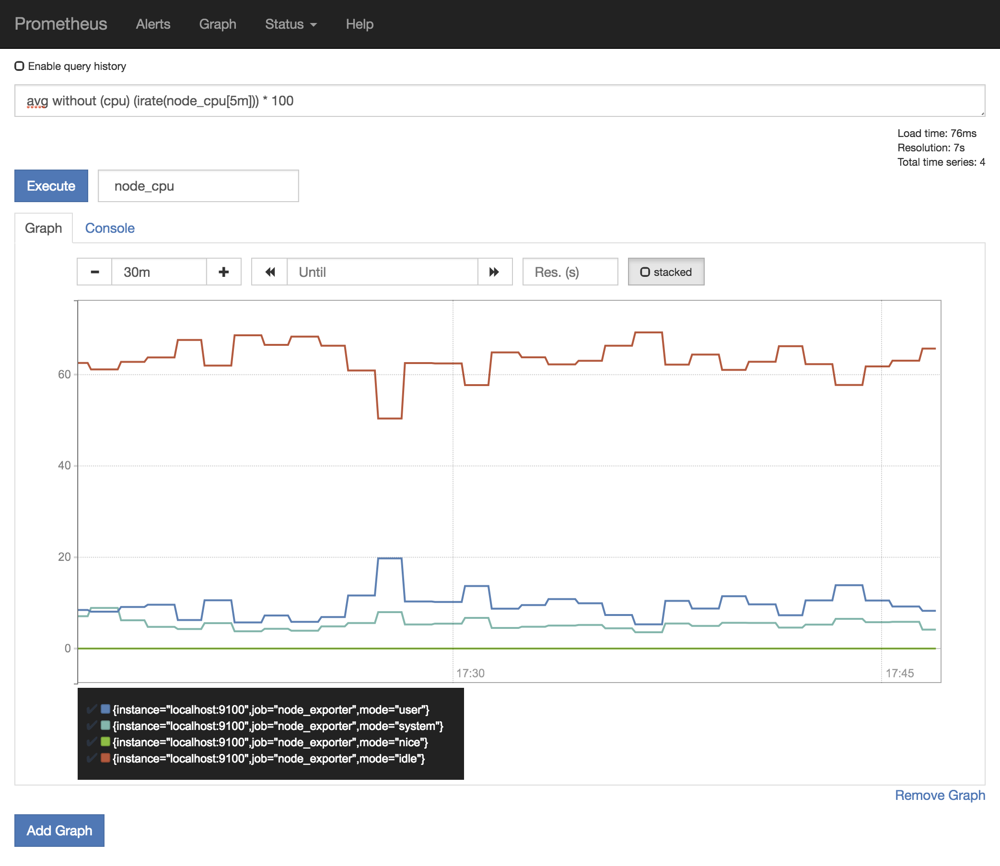

# 2. Monitoring Nodes

As monitoring internal Prometheus metrics is not really what we came for, let's start monitoring actual hardware with the **node_exporter**. This is a separate process, which needs to be running on the system it should extract data from (e.g. a physical server or a VM). For this demo, we're going to monitor our local machine:

```
node_exporter
```

You can see the list of enabled collectors as the process starts up:

```
INFO[0000] Starting node_exporter (version=0.14.0, branch=master, revision=840ba5dcc71a084a3bc63cb6063003c1f94435a6)  source="node_exporter.go:140"
INFO[0000] Build context (go=go1.7.5, user=root@bb6d0678e7f3, date=20170321-12:13:32)  source="node_exporter.go:141"
INFO[0000] Enabled collectors:                           source="node_exporter.go:160"
INFO[0000]  - time                                       source="node_exporter.go:162"
INFO[0000]  - cpu                                        source="node_exporter.go:162"
INFO[0000]  - filesystem                                 source="node_exporter.go:162"
INFO[0000]  - loadavg                                    source="node_exporter.go:162"
INFO[0000]  - meminfo                                    source="node_exporter.go:162"
INFO[0000]  - netdev                                     source="node_exporter.go:162"
INFO[0000] Listening on :9100                            source="node_exporter.go:186"
```

The [full list of available collectors](https://github.com/prometheus/node_exporter#collectors) is described in the node_exporter documentation.

Now, start Prometheus again **in a different terminal window from this directory**:

```
prometheus
```

Now taking the output of `http://localhost:9100/metrics`, let's take a look at a metic called `node_cpu_seconds_total`. It's the seconds the CPUs spent in each mode.

My machine has a quad-core processor, so `node_cpu_seconds_total` looks like this:

```
# HELP node_cpu Seconds the cpus spent in each mode.
# TYPE node_cpu counter
node_cpu_seconds_total{cpu="cpu0",mode="idle"} 635440.4140625
node_cpu_seconds_total{cpu="cpu0",mode="nice"} 0
node_cpu_seconds_total{cpu="cpu0",mode="system"} 91017.9921875
node_cpu_seconds_total{cpu="cpu0",mode="user"} 133122.078125
node_cpu_seconds_total{cpu="cpu1",mode="idle"} 770150.359375
node_cpu_seconds_total{cpu="cpu1",mode="nice"} 0
node_cpu_seconds_total{cpu="cpu1",mode="system"} 28714.6640625
node_cpu_seconds_total{cpu="cpu1",mode="user"} 60700.328125
node_cpu_seconds_total{cpu="cpu2",mode="idle"} 659410.6171875
node_cpu_seconds_total{cpu="cpu2",mode="nice"} 0
node_cpu_seconds_total{cpu="cpu2",mode="system"} 66238.21875
node_cpu_seconds_total{cpu="cpu2",mode="user"} 133917.1796875
node_cpu_seconds_total{cpu="cpu3",mode="idle"} 765506.1328125
node_cpu_seconds_total{cpu="cpu3",mode="nice"} 0
node_cpu_seconds_total{cpu="cpu3",mode="system"} 30556.484375
node_cpu_seconds_total{cpu="cpu3",mode="user"} 63502.09375
```

You can use the Prometheus interface to query for this specific metric:


While the overall metric is always called `node_cpu_seconds_total`, it is split up by _labels_ (here 'cpu' and 'mode') into more detail. You also see that the numbers have increased in the screenshot. The type of metric is a counter, so the value increases over time.


## Working with metrics

But an absolute, always increasing counter doesn't help us in this case. CPU usage in percent is much more relatable to humans. Also, what happens if the `node_exporter` is restarted and the counter resets? Time for our first PromQL query, the [Prometheus Query Language](https://prometheus.io/docs/prometheus/latest/querying/basics/)!

We're looking for per-second instant rate (_irate_) of increase of our `node_cpu_seconds_total` counter over a period of time (let's say the last five minutes). And as we're looking for a percentage, we multiply the result with 100.

```
irate(node_cpu_seconds_total[5m]) * 100
```

![Query for `irate(node_cpu_seconds_total[5m]) * 100`](./_images/localhost_9090_graph2.png)

Ok, so `cpu0` spent 24.7% in `idle` mode during that time. Interesting, but still a bit impractical. Usually, when you're looking at CPU usage, you're not interested in the single cores, but want to treat it as one unit. We are looking for the _average_ of these metrics, but _without_ the label _cpu_:

```
avg without (cpu) (irate(node_cpu_seconds_total[5m])) * 100
```

![Query for `avg without (cpu) (irate(node_cpu_seconds_total[5m])) * 100`](./_images/localhost_9090_graph3a.png)

Nice, this is already way handier. You can also view the results in the »Graph« view:



Go ahead and try a few other metrics like:

- `node_filesystem_size_bytes` - File system size in bytes
- `node_filesystem_free_bytes` - File system free space in bytes
- `node_load1`, `node_load5`, `node_load15` - System load average over 1, 5 and 15 minutes
- `node_network_transmit_bytes_total` - Outgoing network traffic in bytes
- `node_network_receive_bytes_total` - Incoming network traffic in bytes
