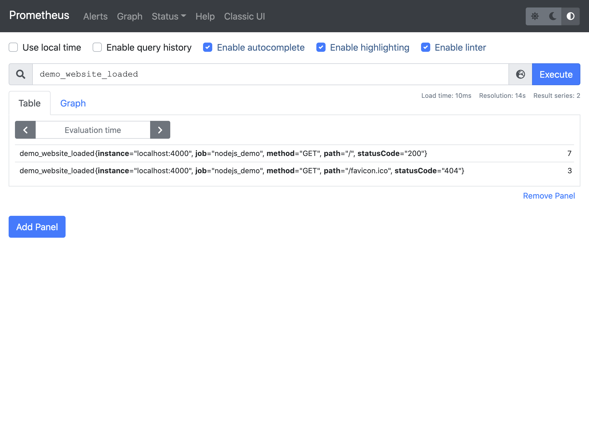

# 3. Monitoring apps

It is very easy to add custom metrics to your app as well. Take a look at the [source code](./index.js) of a little Node.js example. It creates a custom counter variable on startup, which is increased each time the website loads.

Install the required dependencies using `npm install` from this directory (npm comes with Node.js), then run the application:

```
node index.js
```

The web server will start on `http://localhost:4000`. Afterwards start Prometheus again **in a different terminal window** from this directory:

```
prometheus
```

Reload the website a couple of times, if you look at http://localhost:4000/metrics, you will find our previously defined metric again:

```
# HELP demo_website_loaded Counts how many times the website has been loaded
# TYPE demo_website_loaded counter
demo_website_loaded{path="/",method="GET",statusCode="200"} 7
demo_website_loaded{path="/favicon.ico",method="GET",statusCode="404"} 3
```

Which now also ends up in Prometheus:



You could track application requests this way or total and failed logins (a good way to determine if something fishy is going on), track the overall error rate (Did the number of HTTP 500 errors raise after the last deployment?) or any other metric critical for your business.

**npm Packages:**

- [prom-client](https://github.com/siimon/prom-client) - Prometheus client for Node.js
- [promking](https://github.com/sanity-io/promking) - HTTP instrumentation for Express/Hapi
