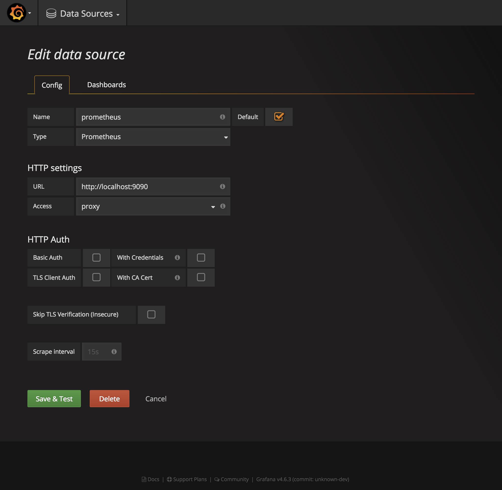
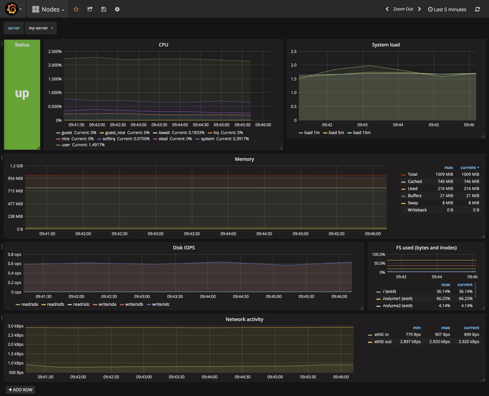
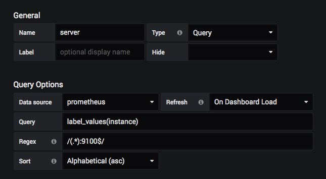
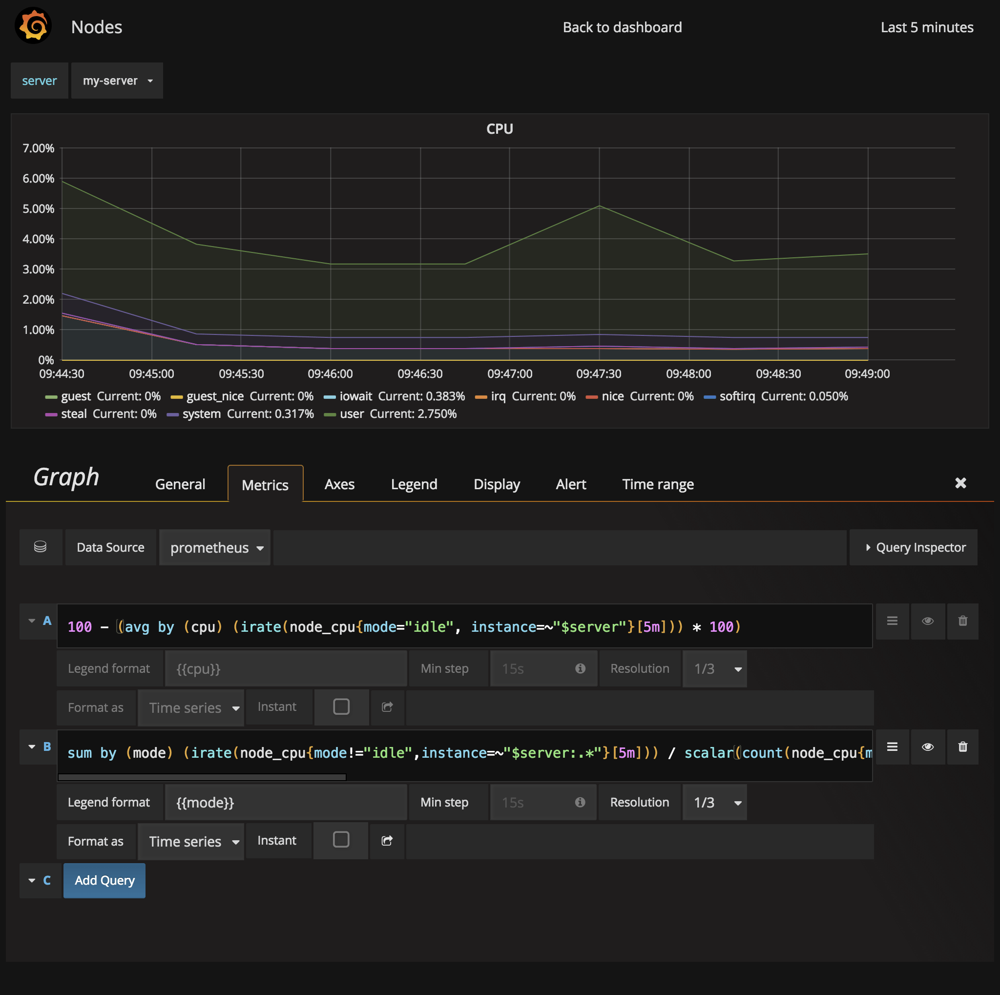
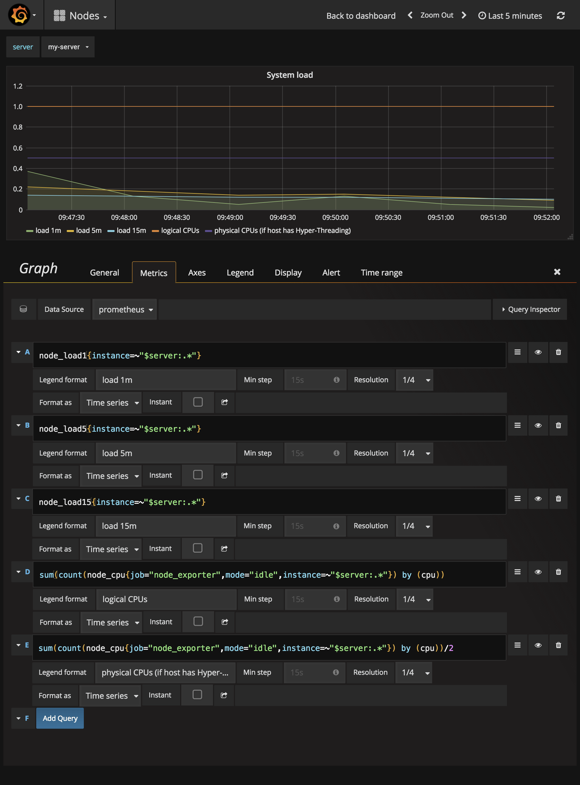
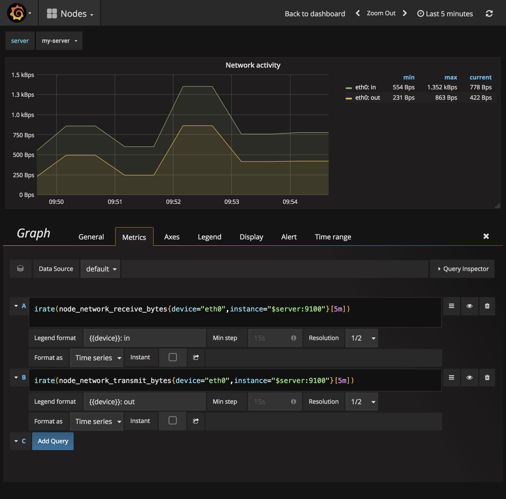

# 6. Dashboards

[Grafana](https://grafana.com) is a great way to visualize data from Prometheus. After installation, add your Prometheus instance as new data source:



The use the same PromQL queries from the chapters before to create charts. Here are a few examples:


## Node dashboard



To avoid defining the same dashboard for various servers over and over again, Grafana supports [variables](http://docs.grafana.org/reference/templating/#variables):



In this case, we define a variable `server` which matches the `instance`, but without the port number from the node exporter (`:9100`) to improve readability. You can use the variables in your queries either as `$server` or `[[server]]`.


### Query details: CPU



```
// CPU usage by CPU core in percent
100 - (avg by (cpu) (irate(node_cpu_seconds_total{mode="idle", instance=~"$server"}[5m])) * 100)

// Total CPU usage by mode
sum by (mode) (irate(node_cpu_seconds_total{mode!="idle",instance=~"$server:.*"}[5m])) / scalar(count(node_cpu_seconds_total{mode="idle",instance=~"$server:.*"}))
```


### Query details: System load



```
// System load during last minute, 5 minutes and 15 minutes
node_load1{instance=~"$server:.*"}
node_load5{instance=~"$server:.*"}
node_load15{instance=~"$server:.*"}

// logical CPUs
sum(count(node_cpu_seconds_total{job="node_exporter",mode="idle",instance=~"$server:.*"}) by (cpu))

// physical CPUs (if host has Hyper-Threading)
sum(count(node_cpu_seconds_total{job="node_exporter",mode="idle",instance=~"$server:.*"}) by (cpu))/2
```


### Query details: Network traffic



```
// Bytes received
irate(node_network_receive_bytes{device="eth0",instance=~"$server:.*"}[5m])

// Bytes sent
irate(node_network_transmit_bytes{device="eth0",instance=~"$server:.*"}[5m])
```
